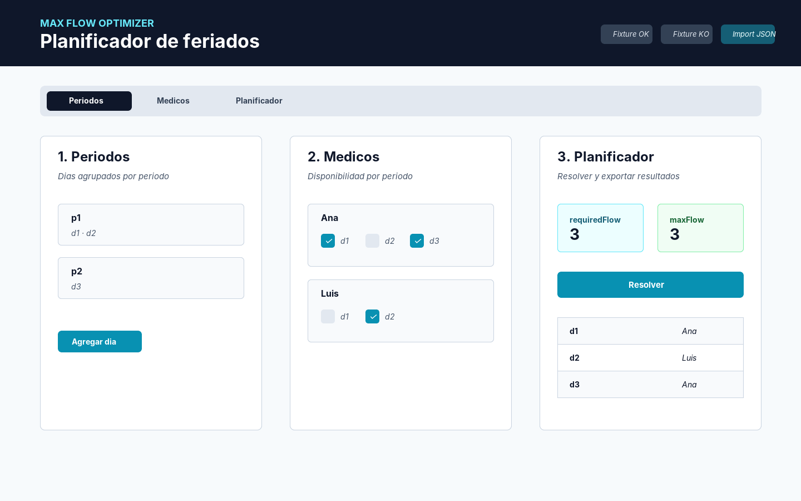
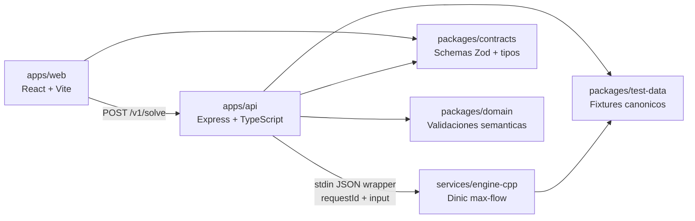

# Max Flow Optimizer

MVP para asignar dias de feriado a medicos usando un modelo de flujo maximo. El proyecto combina un motor C++ reutilizable, una API TypeScript y una UI React para cargar instancias, resolver factibilidad y exportar resultados.

## Tech Stack




## Problema Que Resuelve

En muchos equipos operativos hay que cubrir una lista de turnos, dias criticos o tareas obligatorias con personas disponibles, respetando restricciones simples pero estrictas. En este MVP, el caso concreto es la asignacion de feriados a medicos:

- cada dia debe tener exactamente un medico asignado,
- un medico solo puede ser asignado si esta disponible ese dia,
- ningun medico puede superar el limite global `C` (`maxDaysPerMedic`),
- ningun medico puede tomar mas de un dia dentro del mismo periodo de feriados.

El problema no busca "la asignacion mas linda" ni optimizar preferencias en v1. Busca responder una pregunta previa y mas basica: **existe una asignacion valida que cumpla todas las restricciones?**

## Propuesta De Valor

El sistema convierte un problema operativo facil de explicar, pero propenso a errores manuales, en una validacion reproducible:

- **Factibilidad automatica:** determina si todos los dias pueden cubrirse bajo las reglas definidas.
- **Asignacion trazable:** cuando existe solucion, devuelve `dayId -> medicId` y metricas del solver.
- **Errores claros:** separa errores de contrato, errores de dominio y casos infactibles.
- **Demo end-to-end:** incluye UI, API, motor, fixtures, smoke tests, benchmark y documentacion.
- **Base extensible:** el motor de flujo esta separado de la UI y la API, lo que permite reutilizarlo en problemas parecidos.

## Motor Reutilizable

El nucleo tecnico esta en `services/engine-cpp`: un motor C++ que construye una red de flujo y resuelve max-flow con Dinic. Para este MVP se usa para feriados medicos, pero el patron aplica a otros problemas de asignacion con restricciones de capacidad:

- cobertura de turnos por personal disponible,
- asignacion de guardias o tareas por equipo,
- distribucion de cupos limitados entre candidatos,
- matching entre recursos y demandas cuando cada demanda debe cubrirse una vez,
- validacion de factibilidad antes de aplicar criterios de optimizacion mas avanzados.

La API se comunica con el motor mediante JSON por `stdin/stdout`, asi que el solver no depende de Express, React ni del contrato visual de la app. Esa separacion permite evolucionar el frontend o exponer otro servicio sin reescribir el algoritmo.

## Alcance Del MVP

Incluido en v1:

- UI web con secciones `Periodos`, `Medicos` y `Planificador`.
- Carga manual de periodos, dias, medicos y disponibilidad.
- Fixtures `OK` y `KO` para demo rapida.
- Endpoint `GET /health`.
- Endpoint `POST /v1/solve`.
- Validaciones estructurales con schemas compartidos.
- Validaciones de dominio antes de invocar el motor.
- Motor C++ de max-flow con salida deterministica.
- Resultado factible con asignaciones y metricas.
- Diagnostico minimo para casos infactibles.
- Exportacion JSON y CSV.
- Tests unitarios, integracion API, smoke y benchmark local.

Fuera de alcance en v1:

- autenticacion y multiusuario,
- persistencia de corridas,
- historial de ejecuciones,
- integracion con sistemas hospitalarios reales,
- optimizacion por preferencias, equidad o costos,
- edicion avanzada tipo calendario,
- despliegue productivo completo.

## Arquitectura



## Estructura

- `apps/api`: API HTTP, validacion y adaptador al engine.
- `apps/web`: UI React del MVP.
- `packages/contracts`: contrato HTTP publico v1, tipos y schemas compartidos.
- `packages/domain`: reglas semanticas y limites operativos.
- `packages/test-data`: fixtures canonicos y expected files.
- `services/engine-cpp`: solver C++ y CLI del motor.
- `docs`: PRD, modelo formal, arquitectura, API, calidad y runbooks.

## Quickstart

Prerequisitos:

- Node.js `20.12.2`
- pnpm `9.12.2`
- CMake `3.28.3` o superior
- Ninja `1.11.1` o superior
- compilador C++20

Setup:

```bash
pnpm install
cp apps/api/.env.example apps/api/.env
cp apps/web/.env.example apps/web/.env
pnpm run dev:full
```

URLs locales:

- Web: `http://127.0.0.1:4173`
- API: `http://127.0.0.1:3000`

`pnpm run dev:full` compila el engine C++ antes de levantar API y web. Para desarrollo diario, si el engine ya esta compilado, se puede usar:

```bash
pnpm dev
```

## Comandos Utiles

```bash
pnpm dev
pnpm run dev:full
pnpm lint
pnpm test
pnpm build
pnpm smoke:api
pnpm benchmark:api
```

## Flujo De Demo

1. Cargar `Fixture OK` en la UI.
2. Revisar `Periodos` y `Medicos`.
3. Resolver desde `Planificador`.
4. Ver `feasible=true`, asignaciones y metricas.
5. Exportar JSON/CSV.
6. Cargar `Fixture KO`.
7. Resolver y mostrar `feasible=false` con diagnostico de infactibilidad.

El guion completo esta en [DemoScript.md](docs/00-product/DemoScript.md).

## Calidad

- Pipeline CI: `lint -> test -> build`.
- Smoke local: `tiny-feasible`, `tiny-infeasible-availability` y `medium-random-50x50`.
- Benchmark local documentado en [BenchmarkReport.md](docs/40-quality/BenchmarkReport.md).
- Objetivo v1: p95 <= 1s para instancias de hasta 200 dias y 200 medicos en ambiente local.
- Salida deterministica: mismo input produce el mismo output.

## Mejoras Posibles

Evolucion natural para una v1.1:

- Persistir corridas en SQLite o PostgreSQL.
- Agregar endpoint `GET /v1/runs` para historial.
- Guardar inputs, resultados, metricas y diagnosticos por corrida.
- Mejorar diagnosticos de infactibilidad para explicar cuellos de botella.
- Agregar Docker Compose para demo one-command.
- Enriquecer exportacion CSV con resumen por medico y periodo.

Evolucion para una v2:

- Autenticacion y roles.
- Soporte multi-hospital o multi-equipo.
- Objetivos de optimizacion: equidad, preferencias, costos o penalizaciones.
- Batch solving para multiples escenarios.
- Dashboard historico y analitica.
- Integracion con calendarios o sistemas internos.

## Estado Actual

- MVP v1 implementado de punta a punta.
- Bloques `0` a `5` completados en la ruta de implementacion.
- Release checklist documentado en [ReleaseChecklist.md](docs/00-product/ReleaseChecklist.md).
- Backlog priorizado en [BACKLOG.md](docs/00-product/BACKLOG.md).

## Documentacion Clave

1. [docs/README.md](docs/README.md)
2. [PRD.md](docs/00-product/PRD.md)
3. [Model.md](docs/10-model/Model.md)
4. [API.md](docs/30-api/API.md)
5. [LocalRunbook.md](docs/50-operations/LocalRunbook.md)
